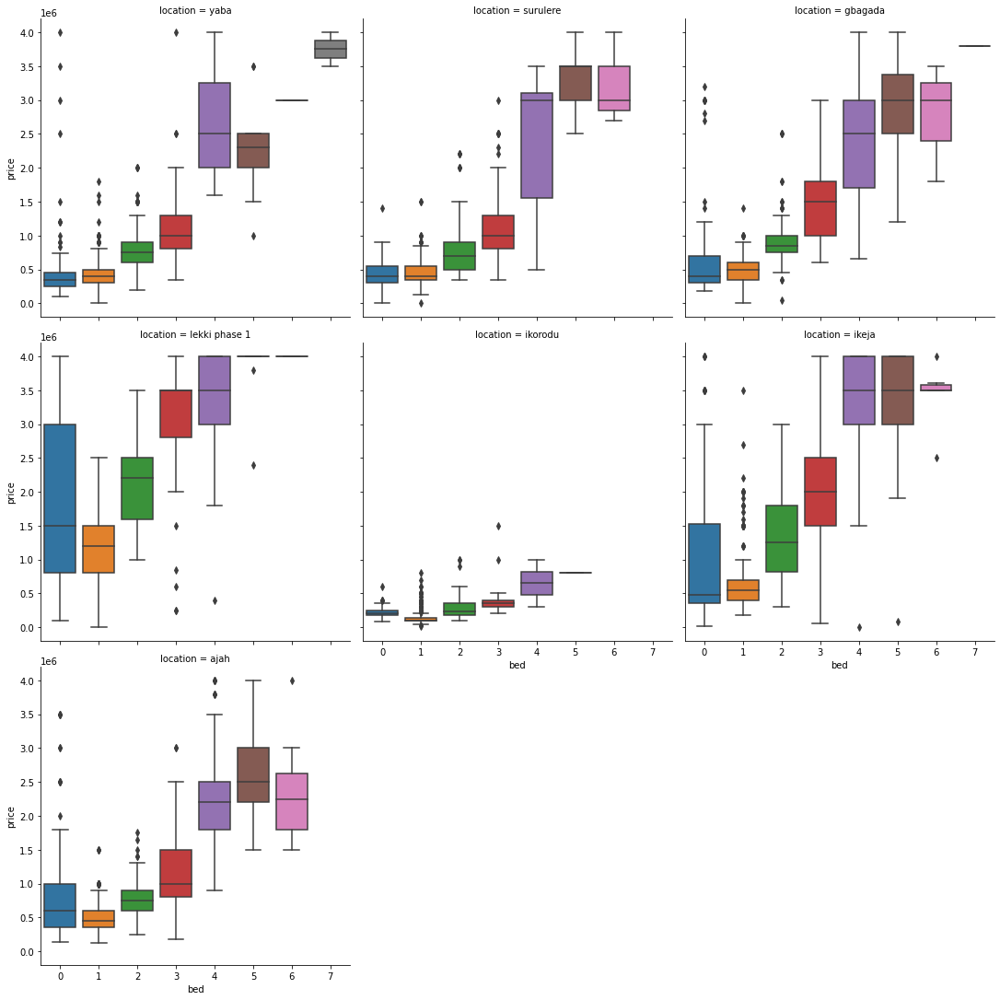

# Lagos House Price Prediction Project

## Project Brief
You just got hired as a data scientist within a real estate property aggregation company that runs an aggregation website. Your organisation has a web app that aggregates properties for rent/sale from various agents across the country. 

A week after your resumption, you get a mail from your boss with the following details:

> Hello,
> 
> Welcome onboard, we need you to help us create a solution that addresses the issues customers have been having. Our customers are complaining about the user experience of the site. They have indicated that they need a rent budget estimator feature that gives them a quick estimate of their rent budget based on parameters such as location, size etc. which will be provided by them. 
> 
> Based on the analysis recently done by the UI/UX team, the average customer typically needs to go through 10-20 web pages of properties to develop reasonable budget estimate. They believe this is not efficient and suggested we develop an algorithm that does this at the click of a button.
<!-- > 

> Also they indicated that we create another feature that recommends areas/houses to rent a house based on customer budget, size of house, desired commute time to work etc. The feature should be able to recommend top 5 options closest to the parameters customers provided. -->

### Tools
- [Plotly Dash](https://dash.plotly.com/) for visualization and web apps.
- Python for machine learning.

### Tasks
#### Level: Beginner
#### Data Path: Data Science
- Using Python, you are expected to scrape the data from propertypro.ng.
- Develop a regression model that predicts house prices based on the data you scraped
- Create a recommender system that recommends areas/houses to rent a house based on customer budget, size of house and desired commute time to work
- Using Plotly Dash, you are expected to create stunning interface which customers can interact with your models on.

### Deliverables
- ML model that predicts house prices
- Dash app that users can interact with to predict prices of house in the following areas Gbagada, Lekki Phase 1, Ajah, Ikorodu, Yaba, Surulere and Ikeja.

## Actions
- I scraped over 64,000 rows of house rent data for Gbagada, Lekki Phase 1, Ajah, Ikorodu, Yaba, Surulere and Ikeja areas of Lagos state via propertypro.ng

- I cleaned the data by removing data with null prices, removing special characters from prices,

  
- Got new fetures to improve data modeling from property details 

- Checked for outliters in the data and treated them apporpratly

- 

